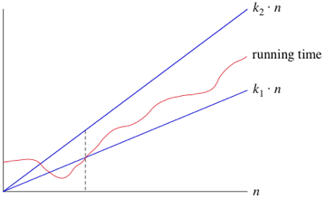

# Section 2.8: Time and Space Complexity

Time complexity = running time of a program as a function of the input size

Space complexity = amount of computer memory that is required during the program execution as a function of the input size

-   Divided into Fixed & Variable parts

Represented by f(n) function where n is the input size

Worst case run time = upper bound
Avg. case run time = average
Best case run time = lower bound
Amortized run time = average performance of related operations, each operation in its worst case

Trade off between time vs space complexity

Log loop = loop controlling variable is divided/multiplied by a constant factor

NlogN = logN loop inside an N loop

Quadratic = nested loops

Dependent quadratic loop = nested loops where nested iteration number is dependent on the outer loop. $n*(n+1)/2$

# Section 2.9: Big O Notation

Generic way of representing the time complexity of an algorithm. How do very large values of N affect the time?

Constant multiplication factors are ignored

Big O notation is used to describe the upper bound (worst case) of an algorithm

Only use the term with the highest power, and ignore constant multiples. E.g. $2n^3 + 3n^2 + 5n - 10 = O(n^3)$

Best case O = upper bound for all combinations of input (e.g. a sorted array)

Worst case O = upper bound for the worst combination of input (e.g. reverse sorted array)

Link to video: https://www.youtube.com/watch?v=g2o22C3CRfU

## Categories of Algorithms

-   $O(1)$ = constant time
-   $O(n)$ = linear time
-   $O(log n)$ = logarithmic time
-   $O(n^k)$ = polynomial time
-   $O(2^n)$ = exponential time

## Example 1

4n^2 = O(n^3)

-   $O(n^3)$ is an upper bound for $4n^2$
-   $0 <= 4n^2 <= cn^3$
-   $0 <= 4/n <= c$
-   $c = 4$ ($4/n$ is maximum at $n=1$)

(more examples available on PDF)

# Section 2.10: Omega Notation (Ω)

Tight lower bound for f(n). The best case scenario.

Function can never do better than Ω(n) but may do worse.

$Ω(n^2)$ includes $n^2, n^2.9, n^3+n^2, n^3$

Best case Ω = lower bound for all input
Worst case Ω = lower bound for worst input

# Section 2.11: Theta Notation (Θ)

The set of functions where the running time is at least $c_1 * g(n)$ and at most $c_2 * g(n)$ for all $n > n_0$, where $c_1$, $c_2$, and $n_0$ are constants.

# Section 2.12: Other Useful Notations

Little o notation - non-tight upper bound. E.g. $2n^2 = o(n^3)$

Little omega notation - non-tight lower bound. $E.g. n^3 = ω(n^2)$
