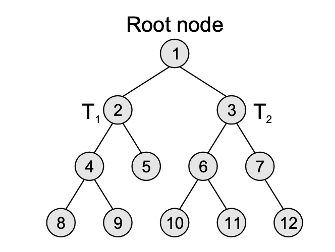
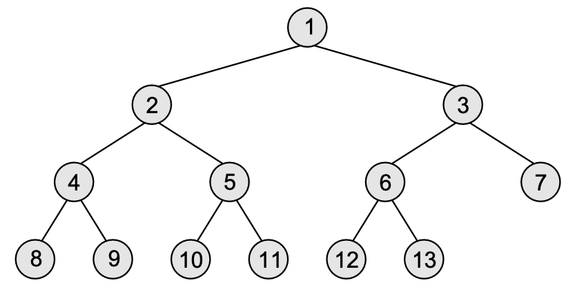
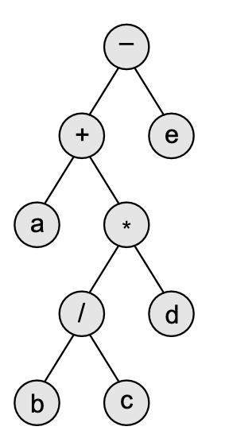

# Trees

## 9.1 Introduction

**Root node** - topmost node in the tree. NULL if empty.

**Sub-trees** - If non-empty, then the trees $T_1$, $T_2$, and $T_3$ are called the sub-trees of R.

**Leaf node** - Node with no children, at the bottom of the tree

**Path** - Sequence of connected nodes.

**Ancestor node** - Any predecessor node on the path from root to that node. Root is ancestor of all, and has no ancestors itself.

**Descendant node** - Any node on the path from a node to a leaf node.

**Level number** - Given by parent_level+1, where root node = 0, children of root = 1, ...

**Degree** - Number of children a node has.

**In-degree** - Number of edges coming into a node.

**Out-degree** - Number of edges going out of a node.

## 9.2 Types of Trees

6 Types:

1. General trees
    - Number of sub trees for any given node is variable.
    - Downside is algorithms become more complex
    - May be converted to a binary tree for algorithms
    - May be converted to a graph data structure
2. Forests
    - Disjoint union of trees, can be obtained by removing the root node
    - Could also be an ordered set of general trees
    - Can be converted to a tree by adding root node
3. Binary trees
    - Collection of binary nodes
      
    - Recursive by definition
    - Terminology:
        - **Parent** - If $N$ is any node in $T$ that has left successor $S_1$ and right successor $S_2$, then $N$ is called the parent of $S_1$ and $S_2$. Correspondingly, $S_1$ and $S_2$ are called the left child and the right child of $N$. Every node other than the root node has a parent.
        - **Level number** - see above
        - **Degree** - see above. Leaf nodes have degree 0.
        - **Sibling** - Nodes at the same level with the same parent.
        - **Similar binary trees** - Two binary trees $T$ and $T'$ are _similar_ if both these trees have the same structure.
        - **Copies** Two binary trees $T$ and $T'$ are _copies_ if they are similar and have the same content at corresponding nodes
        - **Edge** - Connection between a node $N$ and any of its successors. Binary tree of n nodes has exactly n – 1
        - **Path** - see above
        - **Height of a tree** - Total number of nodes on the path from the root node to the ancestor with highest level.
            - A binary tree of height $h$ has at least $h$ nodes and at most $2h–1$ nodes
            - The height of a binary tree with $n$ nodes is at least $log2(n+1)$ and at most $n$.
    - **Complete Binary Trees** - A binary tree that satisfies two properties: 1) every level, except possibly the last, is completely filled. 2) all nodes appear as far left as possible.
        - 
        - Height of a complete binary tree with $n$ nodes is $log_2(n+1)$
    - **Extended Binary Trees** - A binary tree in which every node has either 0 or 2 children.
        - Nodes having two children are called _internal_ nodes and nodes having no children are called _external_ nodes
    - **Linked Binary Tree Representation** - Each node has a pointer to the left and right children.
    - **Sequential Representation of Binary Trees** - Simple but memory inefficient.
        - Store the tree in an array, where the root is at index 1
        - Each child of a node stored in location $K$ will be stored in locations $(2*K)$ and $(2*(K+1))$.
        - Maximum size of the array = $(2^h–1)$
        - Empty tree/subtree = `NULL`
4. Binary search trees
    - Ordered binary tree - a variant in which the nodes are arranged in an order used for binary search
5. Expression trees
    - Binary tree used to represent arithmetic expressions
    - E.g. 
6. Tournament trees
    - Binary tree used to represent a tournament, with winners and losers at each level, creating multiple losers trees
